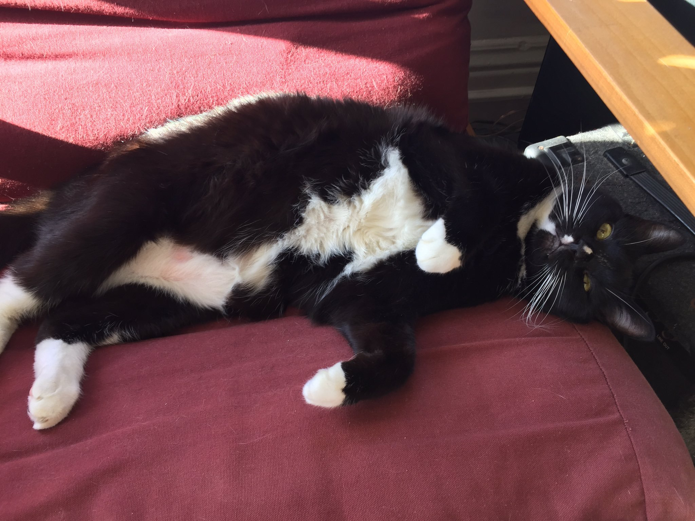

### A quick test post to see how things render when deployed. 

First, some text, and a picture of my cat Leo


Now, let's try some r code with a plot to see how things look

```{r load packages, include=FALSE}
library(tidyverse)
```

```{r mtcarplot, echo=TRUE, message=FALSE, warning=FALSE}

library(tidyverse)

mtcars %>%
	ggplot(aes(disp, wt)) +
	geom_point(color = "blue") 
```
